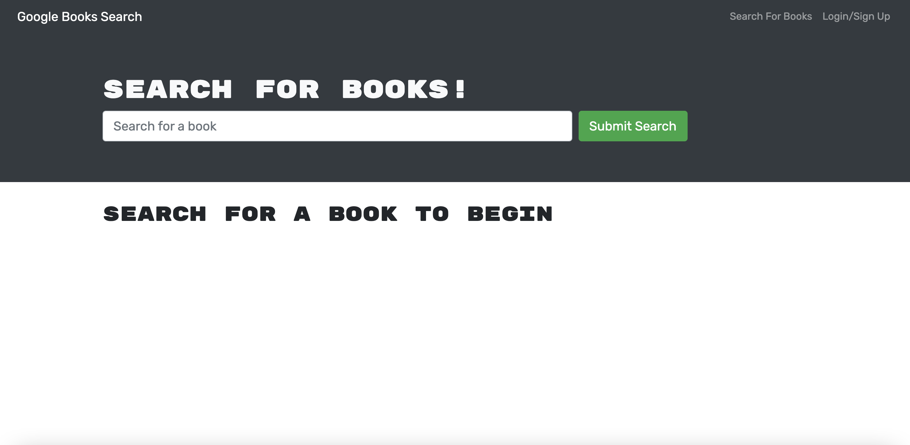
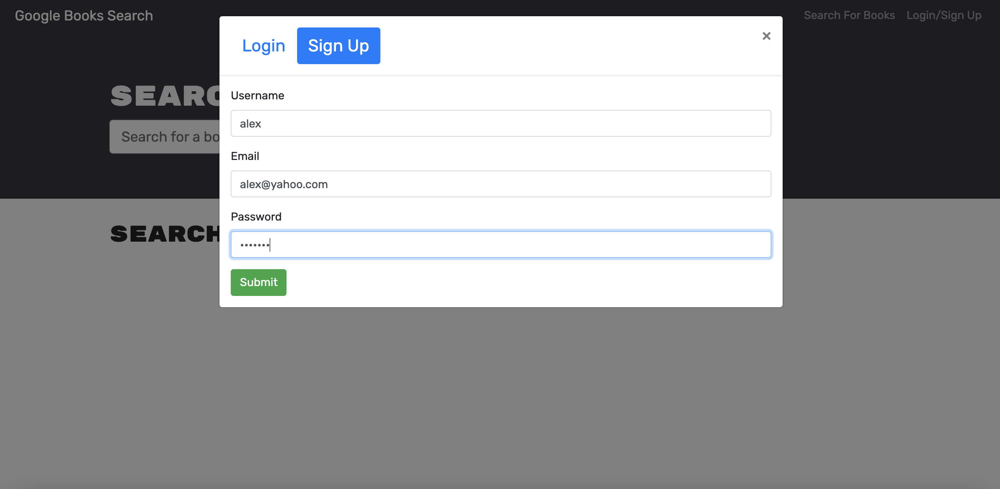
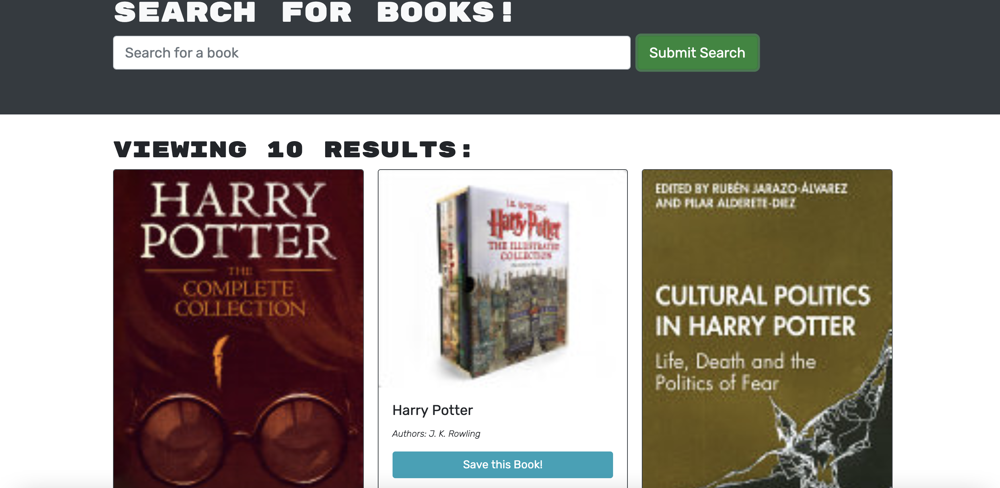

### Book Search Hunt 
  
## Description
As an avid reader I want to search for new books to read
so that I can keep a list of books to purchase.

  ##  Table of Contents
  * [Installation](#installation)
  * [Usage](#usage)
  * [License](#License)
  * [Contributing](#contributing)
  * [Tests](#Tests)
  * [Questions](#questions)
  
  ## Usage
  In order to run this application, you must fork my repo to your local machine and run it using npm start, before doing so please install to your local terminal React using `npm i graphql`.
  
  
  # License
  This project is  licensed MIT license.
  
  ## Contributing
  Contributors: Alex Reveles
  ## Test
  The following is needed to run the test: `npm start`.
  ## Questions
  If you have any questions regarding about the application, please contact me.
* [Github](https://github.com/alexreveles)
* [Email](https://alexreveles@yahoo.com) alexreveles@yahoo.com

### https://github.com/alexreveles/book-search-hunt
### https://alexreveles.github.io/book-search-hunt/
### https://github.com/alexreveles

